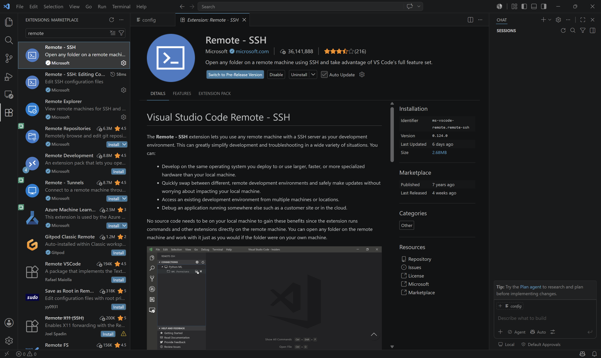
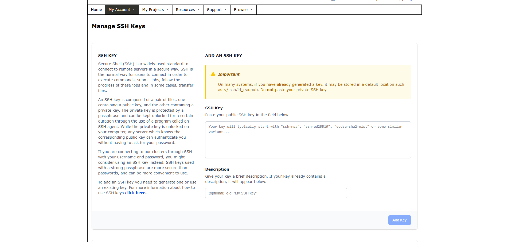
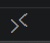

# Tutorial 1: VS Code Installation and DRAC Connection

## Objective

By the end of this tutorial, you will have:

- Installed Visual Studio Code
- Installed the Remote - SSH extension
- Generated an SSH key
- Added your SSH key to your Digital Research Alliance of Canada (DRAC) account
- Connected to the Trillium cluster

---

## Background

Visual Studio Code (VS Code) is a free code editor that can connect directly to remote computers using SSH.

Throughout this guide, VS Code will be used to:

- Edit files stored on the cluster
- Run Linux commands
- Submit jobs
- Develop and test workflows

Although Windows PowerShell can also be used to connect to DRAC clusters, VS Code provides an easier interface for beginners.

---

## Prerequisites

Before starting, ensure that you have:

- A Digital Research Alliance of Canada (DRAC) account
- Your Alliance username
- A Windows computer
- An internet connection

---

## Step 1 – Install Visual Studio Code

Download VS Code from the official website:

https://code.visualstudio.com/download

Install using the default settings.

---

## Step 2 – Install the Remote - SSH Extension

Open VS Code.

Select the **Extensions** icon from the Activity Bar.

Search for:

Remote - SSH

Install the extension published by Microsoft.



---

## Step 3 – Generate an SSH Key

Open Windows PowerShell.

Run:

```bash
ssh-keygen -t ed25519 -C your_email@example.com
```

Press **Enter** to accept the default file location.

Your SSH keys will normally be saved in:

```text
C:\Users\<YourUsername>\.ssh\
```

The public key is stored in:

```text
id_ed25519.pub
```

Open this file using Notepad and copy its entire contents.

---

## Step 4 – Add the SSH Key to DRAC

Log in to your DRAC account.

Navigate to:

**My Account → SSH Keys**

Paste the contents of your public key into the SSH key field.

Select **Add Key**.



---

## Step 5 – Connect to Trillium

Open VS Code.

Click the **Remote Connection** button in the lower-left corner (the symbol should ressemble ).

Choose:

**Connect to Host**

Enter:

```bash
ssh your_username@trillium.alliancecan.ca
```

Replace:

- `your_username` with your Alliance username.
- `trillium` with another cluster name if applicable.

---

## Step 6 – Open the Integrated Terminal

After connecting, open the integrated terminal by selecting:

**Terminal → New Terminal**

This terminal is running on the remote Linux system.

You can now execute Linux commands directly on the cluster.

---

## Step 7 – Verify the Connection

After connecting to Trillium, confirm that the connection was successful.

Open the terminal and run:

```bash
pwd
```

This command displays your current directory. After logging in, you should see your DRAC home directory, which will look similar to:

```text
/home/abc123
```

where `abc123` is your Alliance username.

Next, run:

```bash
hostname
```

This command shows the name of the computer you are connected to. A successful connection should display a Trillium login node, such as:

```text
trillium-login1
```

These commands confirm that you are connected to the Trillium cluster rather than your local computer.


In the future, you can reconnect to Trillium by selecting:

**Remote Connection → Connect to Host → your saved Trillium connection**

VS Code will automatically use your saved SSH key to authenticate.

Congratulations! You are now connected to the Trillium cluster and ready to begin working with files and running commands.
---

## Next Tutorial

Continue to:

**Tutorial 2 – Linux Basics**
